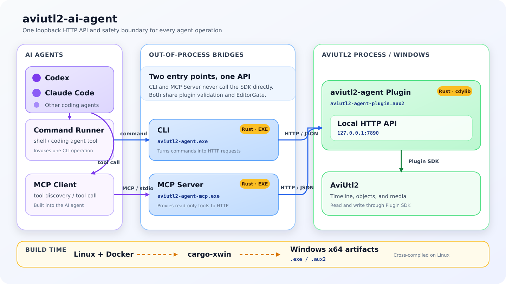

# aviutl2-ai-agent

起動中の AviUtl2 プロジェクトを、ローカルの構造化 API から操作するための
プロジェクトです。AviUtl2 Plugin SDKの基本挙動を調べるPhase 0は完了し、
現在は単一objectを読み書きするPhase 1からPhase 3のAPIを実装しています。Phase 0の観測結果は
[`docs/phase0.md`](docs/phase0.md)、現在の設計範囲は
[`docs/design.md`](docs/design.md)、実施順序は
[`docs/roadmap.md`](docs/roadmap.md)を参照してください。

これは非公式かつ実験段階のプロジェクトであり、AviUtl2公式のプロジェクトでは
ありません。

## ローカルワークスペースとDev Container

このワークスペースでは、`main` や `worktrees/*` のチェックアウトと、ローカル専用の
接続情報を次のように分けて配置します。`credentials/` はGitリポジトリに含めません。

```text
aviutl2-ai-agent/
├── credentials/     # Windows VM接続用の秘密鍵・known_hosts・ssh_config
├── main/            # このリポジトリの基準チェックアウト
└── worktrees/       # 追加のGit worktree
```

credentialsの場所は、どこから見るかによって次のように表記します。

| 視点 | path |
|---|---|
| ホスト | `$HOME/src/aviutl2-ai-agent/credentials` |
| `main/` checkout | `../credentials` |
| Dev Container | `/run/aviutl2-ai-agent-credentials` |

Dev Containerではホスト側のcredentialsを上記のコンテナ内pathへread-onlyで
マウントします。接続設定の準備方法はローカルの `../credentials/README.md`、
Dev Containerの詳細は [`docs/development.md`](docs/development.md) を参照してください。
設定変更後に既存のコンテナへ反映するには、チェックアウトのルートで次を実行します。

```bash
dc rebuild
```

VMの配置場所や実機操作など、個人環境にだけ適用する運用手順は、リポジトリルートの
`AGENTS.local.md` に記述します。このファイルはGit管理対象外で、共有ルールを置き換えず
`AGENTS.md`へ追加するローカル手順として扱います。秘密鍵やtokenなどの資格情報そのものは
記載せず、credentials側で管理してください。

## アーキテクチャ



CodexやClaude CodeなどのAIエージェントは、コマンドとしてCLIを呼び出すか、
内蔵するMCP ClientからMCP Serverへtool callを送ります。プラグイン、CLI、MCP Serverは
いずれもRust製です。CLIとMCP ServerはWindowsのEXEとしてprocess外で動作し、
プラグインは`cdylib`からAviUtl2用の`.aux2`として生成します。CLIとMCP Serverは
Windows上のloopback HTTP APIへ接続し、AviUtl2 Plugin SDKを直接呼びません。

HTTP APIを提供するプラグインがvalidationとSDKアクセスの直列化を担うため、CLI経路と
MCP経路は同じ安全性境界を通ってAviUtl2のタイムラインを読み書きします。
プラグイン、CLI、MCP ServerのWindows x64成果物は、Linux上の正規Docker buildから
`cargo-xwin`でクロスコンパイルします。

## 開発時の確認

```bash
cargo test --workspace
cargo run -p aviutl2-ai-agent -- health
cargo run -p aviutl2-ai-agent -- status
cargo run -p aviutl2-ai-agent -- current-scene
cargo run -p aviutl2-ai-agent -- current-timeline
cargo run -p aviutl2-ai-agent -- current-objects
cargo run -p aviutl2-ai-agent -- current-object-details
```

MCP serverはstdioで起動します。公式Rust SDKを使用し、MCP `2026-07-28`の
`server/discover` lifecycleとlegacy `initialize` lifecycleをサポートします。

```bash
cargo run -p aviutl2-ai-agent-mcp
```

公開するread toolは `get_current_scene`、`get_current_timeline`、
`list_current_objects`、`list_current_object_details` です。Phase 2・3のwrite契約には `move_object`、
`delete_object`、`create_text_object`、`duplicate_object`、`create_media_object`が
対応し、既存text本文の更新には`update_text_object`を使います。MCP server自身もloopback HTTP APIを経由し、write toolはCodexなどの
clientで承認対象になります。

Windows x64の正規ビルド成果物をCodexへ登録する場合は、PowerShellで次を実行します。
絶対pathを登録するため、別のworking directoryからCodexを起動しても同じserverを
起動できます。

```powershell
$mcpServer = (Resolve-Path .\dist\aviutl2-agent-mcp.exe).Path
codex mcp add aviutl2 -- $mcpServer
codex mcp list
```

登録後にCodexを再起動し、`/mcp`で `aviutl2` と10個のtoolを確認します。AviUtl2と
pluginを起動してprojectを開き、同じtimeline状態のまま次を依頼します。

```text
AviUtl2の現在のscene、timeline概要、object一覧をread-only toolで取得して要約して。
```

read評価時は、3つのread toolが成功したか、object件数、tool応答のおおよその文字数、一覧だけでは
判断できなかった情報を記録します。objectが多いprojectでも一覧が過度に冗長でなければ、
ページングは追加しません。接続に失敗した場合は、先に
`dist\aviutl2-agent.exe health` でHTTP APIを切り分けます。

各コマンドは、Windows 上のプラグインが
`http://127.0.0.1:7890` で待ち受けていることを前提とします。

## Windows Phase 1 スモークテスト

1. `dist/aviutl2-agent-plugin.aux2` を AviUtl2 のプラグインディレクトリへコピーします。
2. AviUtl2 を起動し、プラグイン情報に `aviutl2-ai-agent Phase 1` が表示されることを確認します。
3. `dist\aviutl2-agent.exe health` を実行します。
4. `dist\aviutl2-agent.exe status` を実行します。
5. プロジェクトを開き、`dist\aviutl2-agent.exe current-scene`、
   `dist\aviutl2-agent.exe current-timeline`、`dist\aviutl2-agent.exe current-objects`
   を実行します。

既存objectのmoveは、直前の`current-objects`で得た完全なsnapshotを指定します。

```powershell
dist\aviutl2-agent.exe move-object `
  --expected-scene-name Root `
  --layer 0 --start-frame 10 --end-frame 39 --name Title `
  --destination-layer 2 --destination-start-frame 100
```

nameが`null`のobjectでは`--name`を省略します。APIはprojectを保存せず、moveは
AviUtl2のUndo対象になります。

単一objectの削除も完全なsnapshotを指定します。

```powershell
dist\aviutl2-agent.exe delete-object `
  --expected-scene-name Root `
  --layer 0 --start-frame 10 --end-frame 39 --name Title
```

削除もAviUtl2のUndo対象であり、CLIはprojectを保存しません。

改行を含まない単一text objectは次のように作成します。

```powershell
dist\aviutl2-agent.exe create-text `
  --expected-scene-name Root `
  --layer 1 --start-frame 100 --length 90 --text "Hello"
```

初期契約ではtextにCR、LF、NULを指定できません。作成はAviUtl2のUndo対象で、
CLIはprojectを保存しません。

このコマンドは、Windowsで確認した最小aliasだけを使うplain text presetです。
例えばタイトルや字幕の本文をtimelineへ追加する場合も、同じ単一操作を必要なframeごとに
呼び出します。

```powershell
# 冒頭のタイトル本文
dist\aviutl2-agent.exe create-text `
  --expected-scene-name Root `
  --layer 1 --start-frame 0 --length 150 --text "動画タイトル"

# 途中の字幕本文
dist\aviutl2-agent.exe create-text `
  --expected-scene-name Root `
  --layer 2 --start-frame 300 --length 90 --text "字幕テキスト"
```

既存text objectはdetailsで本文とsnapshotを読み、両方を事前条件として1件だけ更新します。

```powershell
dist\aviutl2-agent.exe current-object-details
dist\aviutl2-agent.exe update-text `
  --expected-scene-name Root `
  --layer 2 --start-frame 300 --end-frame 389 `
  --expected-text "修正前" --text "修正後"
```

`expected-text`には`current-object-details`が返した本文を正規化せずそのまま指定します。
現時点の作成・更新APIはCR、LF、NULを含む新しい本文を拒否するため、複数行字幕の作成・
更新には対応していません。

これらは配置時間の再利用例であり、title/subtitle固有のfont、座標、装飾を保証する
presetではありません。装飾presetは対応するaliasとread-back方法をWindowsで実測して
から追加します。

既存objectの複製も、元objectの完全なsnapshotと重ならない移動先を指定します。

```powershell
dist\aviutl2-agent.exe duplicate-object `
  --expected-scene-name Root `
  --layer 1 --start-frame 100 --end-frame 189 `
  --destination-layer 2 --destination-start-frame 200
```

image/audioはcallerが管理するWindows絶対pathから作成します。

```powershell
dist\aviutl2-agent.exe create-media `
  --expected-scene-name Root `
  --media-path "C:\media\example.png" `
  --layer 1 --start-frame 100 --length 90
```

専用media rootによる制限はありません。相対pathと存在しないfileは拒否されます。
6. AviUtl2 を終了して再起動し、手順3を繰り返します。再起動後も成功すれば、
   プロセス終了後にポート7890を再利用できることを確認できます。ただし、この
   手順だけでは `UninitializePlugin` 内で全workerのjoinが完了したことまでは
   確認できません。

Phase 1では単一AviUtl2 instance用にloopback port 7890を固定しています。
動的port、session discovery、認証は必要性が生じた時点で一緒に設計します。
別のプロセスがすでにポート7890を使用している場合、pluginはAPI serverなしの
無効状態でロードされます。プラグイン情報に表示される
`local API unavailable` の理由を確認し、portを解放してAviUtl2を再起動してください。

## クロスビルド

```bash
docker build --output type=local,dest=dist .
```

`aviutl2-agent-plugin.aux2`、`aviutl2-agent.exe`、`aviutl2-agent-mcp.exe`、
`SHA256SUMS` が
生成されます。プラグインのロードと SDK に依存する検証には、
AviUtl2 を導入した Windows 環境が必要です。
